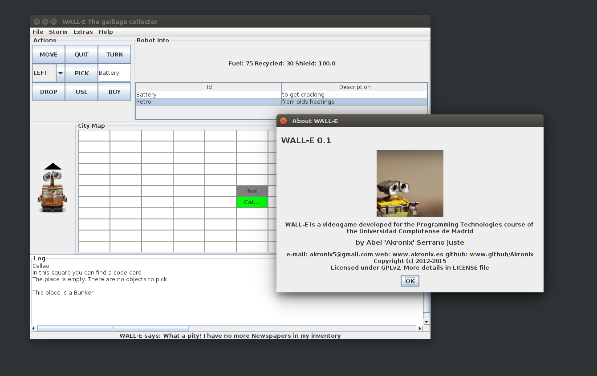

# WALL-E
## What is this?
This is a repo I used to use for my Programming Technology course project in my university.  
It is just something academical with no purpose to be useful.  

It consists in a videogame where the main character is a robot called "WALL-E" which has to explore one city recollecting garbage.  
WALL-E gains points when it gets garbage, you have to go around the city looking for interesting rubbish for the robot. But each movement action WALL-E does requires energy aned WALL-E's fuel it's limited!! so you have to take care about the fuel as well.  
Finally, you have to find where the starship is to finish its mission in this city.

Code is mostly in english, (except for maybe some comments I wrote in spanish).
####Sample:

## What is each thing?
* doc/ : Directory that contains the autogenerated javadoc.
* design/ : Directory that contains some design images for this project. In particular,  execution_of_instruction(UC).png shows the user's case for executing a instruction and design/old/ contains some old Classes Diagram of some parts of the project; these diagrams might not correspond exactly with the current version of the project but helps to have a little idea of how it is organized.
* images/ : Directory that contains the pictures used for the videogame.
* src/ : Directory that contains all the java source code. Also this directory is organized in directories by packages.
* Horda de WALLES.ogv : A video-demo of the app with a little change so that it shows 20 GUI instead of 1 and they synchronize the state changes between them seamlessly.
* informe.txt : short description in spanish of the last changes and decisions taken.
* madrid-all-incorrecto{1,2}.txt: bad defined maps. Just to test incorrect inputs.
* madrid-all.txt / madridConEspacios-all.txt: Sample map defining all the features included in the videogame.
* WALL-E.jar: Executable jar file of the app.
* Eclipse configuration files: the items .classpath, .project and .settings/ are configuration parameters for eclipse if you want to just run the videogame quickly.

The other files are self-explanatory.

## Tell me more technical stuff
It's fully programmed in Java using Eclipse with OpenJDK 1.7, under a GNU/Linux system. I guess it might work on windows, although I haven't tried it.

The eclipse project needs to have added to the build path these libraries: commons cli 1.2 and jgrapht 1.6. You can download the .jar containers for this libraries from this repository. Note that these libraries can be licensed differently to my code.

The GUI is using swing.

## How do I get it working?
### Executing the program
Just download the WALL-E.jar file and execute it with:

    java -jar WALL-E.jar
You will load the default configuration with that, for more interesting configurations execute the command below to see the usage:

    java -jar WALL-E.jar -h
    
### Working with the source
If what you want is to use the project inside Eclipse, the quickest way is just forking the repo, downloading locally and importing the folder in the path you have downloaded it. Note that then you will be using my configuration settings for this project in eclipse. Note that to compile this project into .class files you need a version of JDK >= 1.7

## List of design patterns used
1. MVC: Model - View - Controller. All the classes inside the tp.pr5.view package are for the view; similarly, inside tp.pr5.controller are the controllers and the model consists in most of the rest of the classes.
2. Observer: The GUI view is updated by using the observer pattern. Every element which depends on any of the following videogame elements: inventory, navigation and robot engine; has to implement the according observer interfaces located in tp.pr5.view.observer
3. Command: The abstract class 'Commands' has to be extended for each instruction that WALLE can execute. It allows to undo the instructions. Classes implementing this are in tp.pr5.instructions
4. Abstract Factory: Abstract Factory to give a factory depending on the interface mode which wants the user to use. In this way, it is very easy to change or to add new user interface modes. Classes implementing this are in tp.pr5.userInterfaces
5. Interpreter: The interpreter is in charge of converting the user input in an Instruction instance that the robot engine can understand. The class implementing this is: tp.pr5.Interpreter.java
6. Memento: Previous instruction executed by the robot engine is stored in its attribute 'previousInstruction', so that it can undo that instruction. Also, when UndoInstruction is executed it stores the lastinstrunction executed inside it. Thereby the user can only undo once, next undo will be a redo (undo + undo = redo). Classes implementing this pattern are pr.tp5.RobotEngine and pr.tp5.instructions.UndoInstruction

## Licensing and attributions
Attributions for the images I have used are located in the file images/ATTRIBUTIONS.md and all the information related to the licenses is described in LICENSE.md
